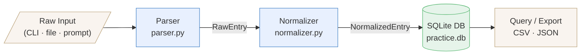

### 🔹 Piano Practice Log

This project turns unstructured piano practice notes into structured, queryable data using an agent-based pipeline.

Instead of forcing rigid input during practice, I keep natural, free-form notes and use AI agents to parse, normalize, and store them automatically.

## Project Overview

Piano Practice Logger ingests free-form or structured practice entries — pieces practiced, duration, tempo, notes — and persists them in a local SQLite database. The three-stage pipeline ensures that raw input is validated, consistently formatted, and stored in a schema ready for analysis and visualization.

---

## Features

- **Flexible input parsing** — Accepts practice logs from CLI arguments, plain-text files, or interactive prompts.
- **Data normalization** — Standardizes durations, tempos, piece titles, and tags for consistent querying.
- **SQLite storage** — Zero-config local database with full SQL access for ad-hoc analysis.
- **Session summaries** — Query total practice time by day, week, piece, or custom date range.
- **Export support** — Dump sessions to CSV or JSON for use in notebooks or dashboards.
- **Idempotent imports** — Duplicate entries are detected and skipped automatically.

---

## Architecture

The application is organized around three core processing stages:

| Stage          | Module              | Responsibility                                                  |
|----------------|---------------------|-----------------------------------------------------------------|
| **Parser**     | `parser.py`         | Tokenizes raw input into structured `RawEntry` objects.         |
| **Normalizer** | `normalizer.py`     | Validates, cleans, and transforms entries into `NormalizedEntry` objects. |
| **Database**   | `db.py`             | Maps normalized entries to SQLite rows; handles queries and exports. |

A thin **CLI layer** (`cli.py`) orchestrates the pipeline and exposes user-facing commands.

---

## Pipeline Diagram

## Pipeline Diagram

---
## ⚙️ Setup

To run any of the projects in this repository, follow the general setup guide:

👉 See [`SETUP.md`](./SETUP.md)

## 🤝 Notes

* Require API keys (stored securely using `.env`, see [`SETUP.md`](./SETUP.md))
* Use third-party tools or services
* Include experimental features
